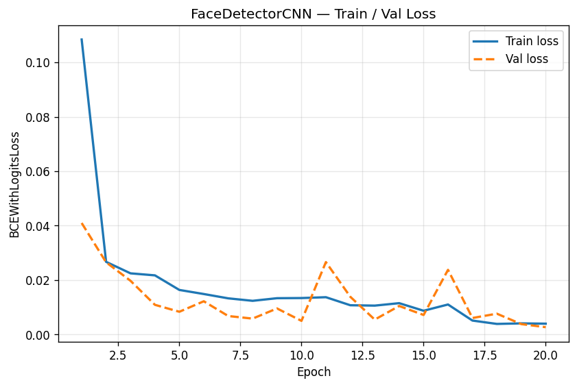
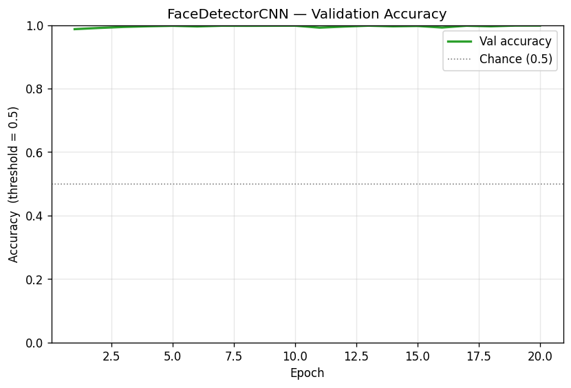
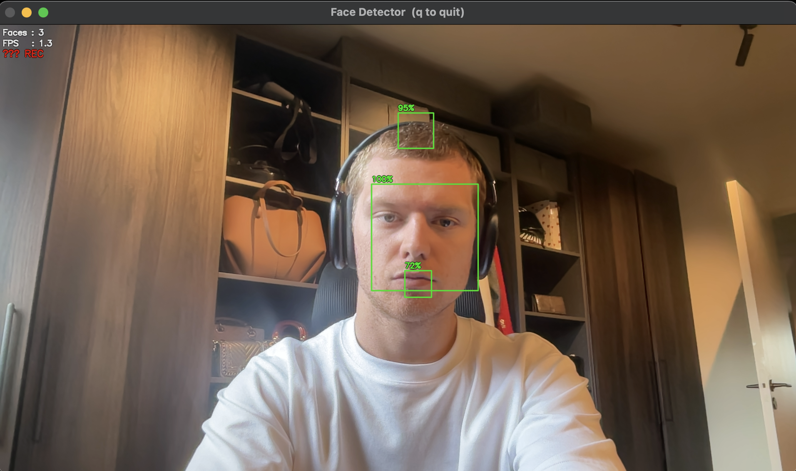

# FaceDetectorCNN

**Face detection from scratch using a custom-trained CNN in PyTorch — no pretrained models, no OpenCV Haar cascades.**


---

## Why I built this

Back in 2022 I was living in student accommodation and my dorm owner had a habit of walking into my room unannounced while I was out. I wanted a way to know when someone entered, get a notification, and have a video record. A security camera solved the practical problem, but I also wanted to actually understand what was happening under the hood.

I'd used Haar cascades before — `cv2.CascadeClassifier` in three lines. It works, but it's a 2001 algorithm and using it teaches you nothing about how modern face detection actually works. So I decided to build the classifier myself: write the dataset pipeline, design the CNN, train it from scratch, and wire it to a live webcam feed. That was the 2022 version — hacky, functional, but not something I'd show anyone.

In 2026 I came back to it and rebuilt the whole thing properly with the help of Claude. Same idea, cleaner architecture, better separation of concerns, and this time I actually documented the decisions that matter. The AI helped with implementation speed and catching edge cases I'd have hit in testing — but the architecture decisions (manifest-based dataset, logits vs probabilities, batched unfold for the sliding window) were worked out collaboratively, not generated wholesale.

---

## How it works

The core idea is a **binary patch classifier**: train a CNN to answer one question — does this 64×64 image patch contain a face? Then at inference time, slide that window across every position in a camera frame at multiple scales, collect patches where the model is confident, and merge overlapping hits with NMS.

### Detection pipeline

```
webcam frame (BGR, 1920×1080)
        │
        ▼  BGR → RGB  (OpenCV and PyTorch disagree on channel order)
        │
        ▼  ImageNet normalise  (mean/std from config — must match training exactly)
        │
   ┌────┴──────────────────────────┐
   │  Image Pyramid                │  scales: [1.0, 0.75, 0.5, 0.25]
   │  (resize frame to each scale) │
   └────┬──────────────────────────┘
        │
        ▼  torch.unfold()  — extract all 64×64 patches in one tensor op (no Python loop)
        │
        ▼  batched CNN forward pass  (256 patches/call, GPU-chunked to cap VRAM)
        │
        ▼  sigmoid → filter at confidence threshold (0.70)
        │
   ┌────┴──────────────────────────┐
   │  candidate boxes              │  (x, y, w, h, confidence) rescaled to original frame
   └────┬──────────────────────────┘
        │
        ▼  Non-maximum suppression  (IoU threshold: 0.10)
        │
        ▼  draw boxes + confidence labels → display + optional MP4 recording
```

### CNN architecture

The model is intentionally small. It needs to run thousands of times per frame, so keeping the parameter count low matters more than squeezing out extra accuracy.

```
Input: 3 × 64 × 64  (RGB, ImageNet-normalised)
        │
        ▼  ConvBlock 1: Conv2d(3→32, 3×3, no pad) → BatchNorm → ReLU → MaxPool(2×2)
        │  output: 32 × 31 × 31
        │
        ▼  ConvBlock 2: Conv2d(32→64, 3×3, no pad) → BatchNorm → ReLU → MaxPool(2×2)
        │  output: 64 × 14 × 14
        │
        ▼  ConvBlock 3: Conv2d(64→128, 3×3, no pad) → BatchNorm → ReLU → MaxPool(2×2)
        │  output: 128 × 6 × 6
        │
        ▼  Flatten → 4608
        │
        ▼  Linear(4608 → 512) → ReLU → Dropout(0.5)
        │
        ▼  Linear(512 → 1)
        │
        ▼  raw logit  ──►  BCEWithLogitsLoss during training
                      ──►  sigmoid() at inference → confidence in [0, 1]

Total: 2,453,793 trainable parameters
```

A few specific choices worth noting: no padding on the conv layers (edge pixels of a face patch tend to be background anyway), `bias=False` on Conv layers since BatchNorm has its own learnable bias, and the model outputs raw logits rather than probabilities — `BCEWithLogitsLoss` is numerically stabler than `BCELoss + Sigmoid` for exactly this reason.

### Dataset

13,233 positive samples from [LFW (Labeled Faces in the Wild)](http://vis-www.cs.umass.edu/lfw/), downloaded automatically via sklearn's `fetch_lfw_people`. Each crop is resized to 64×64 RGB and saved as PNG.

13,233 negative samples mined from COCO 2017 train images (118k images, randomly sampled). Each negative is a random 64×64 crop from a background-only image, extracted at a random scale between 0.5× and 2.0× to give variety. The multiscale jitter is intentional — it mimics the different effective resolutions the sliding window will see at inference time.

Both splits are tracked in a manifest CSV (`data/manifest.csv`) rather than separate folders. This makes hard-negative mining straightforward: a second training phase would just append new rows to the same file without restructuring anything. The architecture supports it via `append_hard_negatives()` in `dataset.py` — I just haven't run that phase yet.

Training uses a stratified 80/20 split with `WeightedRandomSampler` to keep each mini-batch balanced regardless of class ratio.

---

## Training results

Trained for 20 epochs on Apple M2 Pro (MPS), roughly 75 seconds per epoch (~25 minutes total). The learning rate started at 1e-3 and was halved by `ReduceLROnPlateau` after epoch 16 when the val loss stagnated, dropping to 5e-4 for the final four epochs.

| Epoch | Train Loss | Val Loss | Val Accuracy | LR |
|------:|----------:|--------:|:-----------:|:---:|
| 1 | 0.1084 | 0.0409 | 98.75% | 1e-3 |
| 5 | 0.0163 | 0.0083 | 99.81% | 1e-3 |
| 10 | 0.0134 | 0.0050 | 99.85% | 1e-3 |
| 16 | 0.0110 | 0.0237 | 99.26% | 1e-3 |
| 17 | 0.0051 | 0.0060 | 99.83% | **5e-4** |
| 20 | 0.0039 | **0.0026** | **99.89%** | 5e-4 |

**Final metrics (best checkpoint, val set):**

```
              precision    recall  f1-score   support
     no-face     0.9996    0.9981    0.9989      2647
        face     0.9981    0.9996    0.9989      2647
    accuracy                         0.9989      5294
  AUC-ROC: 1.0000
```





The val loss spike at epoch 11 and 16 is visible in the curve — this is normal noise with a dataset of this size and the aggressive Dropout(0.5). The LR drop at epoch 17 smooths it out cleanly.

---

## Real-world performance



The model detects faces in real-time at 1–2 FPS using the full four-scale pyramid. Confidence on a straight-on face in good lighting is typically 95–100%. The recording system kicks in automatically when detection starts and stops five seconds after the last detection.

That said, 1-2 FPS is the hard constraint of sliding window on any hardware — you're running the CNN several thousand times per frame. On MPS it's fast enough to be useful for a security camera use case (you're recording and reviewing, not gaming), but not for smooth real-time video.

---

## Known limitations

I want to be honest about where this breaks down, because "99.89% accuracy on LFW validation" doesn't tell the whole story.

**Multiple boxes on the same face.** The sliding window at four different scales produces detections at different sizes for the same face. NMS with IoU threshold 0.10 handles most of it, but occasionally two boxes survive — typically a 64×64 box from scale 1.0 and a 128×128 box from scale 0.5, which have a geometric IoU of only ~0.25 even when perfectly aligned. Tuning the IoU threshold lower reduces this but increases the risk of merging two actually distinct nearby faces.

**False positives on face-like objects.** The model fires on door handles, certain bag textures, and high-contrast circular objects. This is a known weakness of patch classifiers trained only on random negatives — the model learns "not obviously a non-face" rather than "definitely a face". Phase 2 hard negative mining (run the trained detector over real backgrounds, collect false positives, retrain) would fix this. The codebase supports it, I just haven't run that pass yet.

**LFW is a clean dataset.** 99.89% on the validation split is a real number, but LFW images are relatively frontal, reasonably lit, and the negatives are random patches which are easy to distinguish. Real-world precision will be lower — the model hasn't seen heavy occlusion, extreme lighting, profile faces, or children's faces in training. It'll still detect you, just less reliably in harder conditions.

**1-2 FPS.** Already mentioned but worth repeating. The sliding window fundamentally doesn't scale. If you wanted 30 FPS detection you'd need to replace it with a single-shot architecture (YOLO, SSD) or at minimum add temporal caching so you don't re-run the full pyramid every frame.

---

## What I'd improve next

- **Run hard negative mining phase 2** — record a few minutes of background video, run the detector over it, collect every false positive above 70% confidence, add them to the training set, retrain. This is the single biggest real-world accuracy improvement available.
- **Replace sliding window with an anchor-based detector** — proper speed fix rather than tuning the pyramid scales.
- **Push notifications** — the recording trigger already exists in `_Recorder`; wiring it to send a notification on detection start is straightforward.
- **Web dashboard** — browse recorded clips, annotate which detections were correct, use those annotations for the hard negative mining pass.

---

## Project structure

```
facedetec/
├── dataset.py        # LFW download, COCO negative mining, FaceDataset, DataLoaders
│                     # Manifest-driven: all samples tracked in data/manifest.csv
├── model.py          # FaceDetectorCNN architecture + build_model() + load_checkpoint()
├── train.py          # Training loop: Adam, ReduceLROnPlateau, checkpointing, metrics
├── detect.py         # Detector class: image pyramid, batched unfold, NMS
├── main.py           # Webcam loop: draw boxes, FPS counter, recording state machine
├── config.yaml       # Every hyperparameter and path — single source of truth
├── requirements.txt
├── data/
│   ├── manifest.csv  # path,label rows for every training sample
│   ├── positives/    # 13,233 LFW face crops (64×64 RGB PNG)
│   └── negatives/    # 13,233 COCO background patches (64×64 RGB PNG)
├── checkpoints/
│   ├── best_model.pth   # lowest val loss checkpoint (used by main.py)
│   └── last_model.pth   # most recent epoch (used for --resume)
├── screenshots/         # timestamped PNG snapshots, one per detection event
└── runs/
    ├── metrics.csv       # per-epoch train/val loss and accuracy
    ├── loss_curve.png
    └── accuracy_curve.png
```

---

## Installation

```bash
# Clone and enter
git clone https://github.com/NikolaiDoesCode/facedetec.git
cd facedetec

# Create a virtual environment (required — avoids system Python conflicts)
python3 -m venv .venv
source .venv/bin/activate   # Windows: .venv\Scripts\activate

# Install dependencies
pip install -r requirements.txt
```

You'll need background images for negative mining. I used COCO 2017 train (~18 GB, 118k images). Point `data.backgrounds_dir` in `config.yaml` at wherever you extracted them.

---

## Usage

**Build the dataset** (downloads LFW automatically, mines negatives from your background images):

```bash
python dataset.py
# → data/positives/  (13,233 face crops)
# → data/negatives/  (13,233 background patches)
# → data/manifest.csv
```

**Verify the pipeline works before committing to a full run:**

```bash
python train.py --smoke-test
# 2 epochs, 100 samples, finishes in ~10 seconds
# outputs to checkpoints/smoke_test/ and runs/smoke_test/ — won't pollute real run
```

**Train:**

```bash
python train.py                                    # 20 epochs, ~25 min on M2 Pro
python train.py --resume checkpoints/last_model.pth  # resume after interruption
```

**Run live detection:**

```bash
python main.py                                          # default camera, recording + screenshots on
python main.py --camera 1                               # external webcam
python main.py --no-record                              # display only, no video files
python main.py --no-screenshot                          # video recording but no PNG snapshots
python main.py --checkpoint checkpoints/best_model.pth  # explicit weights path
```

Press `q` to quit. Recordings save to `recordings/` as timestamped MP4s.

---

## Key config values

Everything in `config.yaml`. The ones you're most likely to want to change:

| Key | Value | What it does |
|-----|-------|-------------|
| `detection.detection_threshold` | 0.70 | Minimum confidence to generate a candidate box |
| `detection.nms_iou_threshold` | 0.10 | IoU cutoff for NMS — lower = more aggressive deduplication |
| `detection.scales` | [1.0, 0.75, 0.5, 0.25] | Pyramid scales — fewer scales = faster but misses size variation |
| `detection.step_size` | 16 | Sliding window stride — larger = faster, coarser |
| `training.epochs` | 20 | Full run epochs |
| `training.batch_size` | 64 | Fine for MPS/GPU, reduce to 32 for CPU |

---

## License

MIT
